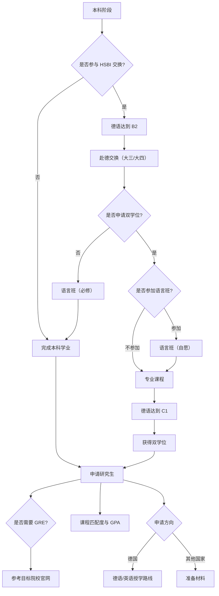

# 留学

## HSBI 双学位

### 参与流程

首先在比科大，大三、大四学年有机会去到德国比勒费尔德（HSBI）留学交换。是否交换尊重个人意愿，学业要求上主要就是保证不挂科，以及达到德语 B2 水平（德福，歌德皆可）。但对于2023、2024届学生来说，德语 B2 几乎不会有人能过，所以能否参与 HSBI 交换主要取决于 APS 面试。获得 HSBI 双学位需要在德国完成相应专业课程并达到德语 C1 水平。

### HSBI 语言班

如果是非双学位组的话是强制上的，双学位组的话是自愿上，有可能需要跟他们一起拼班。

### 学期安排

春季学期为 3 月份开始至 8 月份，秋季学期为 9 月份至次年 2 月份

### APS 面试

APS 面试简单说就是用德语讲你专业课学过的东西回答问题，目前是在学校考，学校会将录音交给使馆。据 23 届学长反馈难度较大，并且会在期末考试前一周多进行，需要较强的德语能力和专业课能力。

### 上课住宿地点

学校会尽量帮助赴德学生寻找住宿，但据目前了解，学校还没有安排学生公寓，主要是单人单间公寓（Einzelstudio），当然学生也可以自主寻找住所。
上课地点目前主要在居特斯洛校区（Gütersloh）与明登校区（Minden），主校区（比勒费尔德）目前还去不了。

## 申请研究生

### GRE

在比科大有一个小优势就是如果你拿到了 HSBI 双学位，也就是说你是德国本科学历，你就不需要在申请某些学校（eg, 慕尼黑工业大学）时考 GRE。具体是否考 GRE 需要看学校官网。

慕工大 [FAQ](https://www.tum.de/en/studies/support-and-advice/faq) 中关于 **Do I need GRE or GATE** 的部分摘录如下：

> All Master’s degree programs within the Professional Profile Informatics as well as the master’s degree program M.Sc. Data Engineering and Analytics offered by the TUM School of Computation, Information and Technology: GRE (general) or GATE, if you have completed your qualification for postgraduate studies (e.g. your Bachelor’s) in **India, Bangladesh, Pakistan, China or Iran**. Minimum score: QR 164, AW 4.0.

### 专业匹配度

虽然比科大有很多水课（例如<s>某千分课</s>）但其实跟升学还是密切相关的，德国那边很看重课程匹配度，因此若水课多的话我们上过的课程多，也就意味着以后我们的匹配度可以比较高。

### GPA 计算

TBD.

### 申请德国

1. 德语 B2 及以上加GPA（德语授学）。
2. 德语 A2 或 B1 加雅思成绩加GPA（英语授学）。
3. 纯英语雅思加专业课成绩（英语授学）。

### 申请其他国家

TBD.
