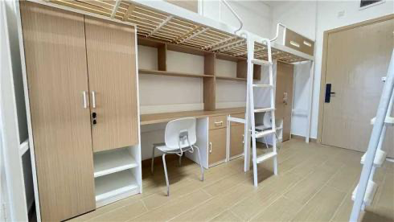
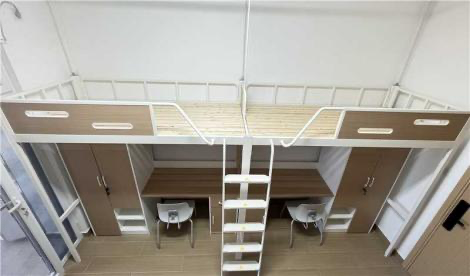
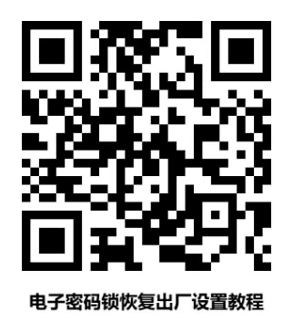
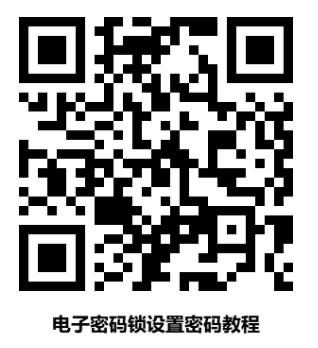

# 住宿

## 学生宿舍1栋/2栋概况

学生宿舍1栋/2栋位于校园一期东侧，毗邻东侧校门，西侧为学生中心，南侧为教师公寓。

学生宿舍为两栋 13 层的高层建筑，底层做架空处理。总建筑面积约 30500 平方米，为学生提供四人间标准房型，宿舍约可容纳 2500 人。

宿舍楼内提供24小时公共安全服务，并在每栋一楼设有宿管值班室、会客室、生活服务商铺及室外活动空间，可供学生学习、休闲娱乐，或举办活动。

学生宿舍楼的房型均为四人间（2025年新生默认三人一间，2024级和2023级是两人一间），共有 13 层楼，楼内配有无障碍/电梯，每层楼均设有茶水区及公共活动区。

## 宿舍配置

桌柜一体床（含床垫和蚊帐架）、椅子、窗帘、空调、空气净化器、洗衣机、独立卫浴。

## 家具尺寸参考

| 家具名称   | 长度 (mm) | 宽度/深度 (mm) | 高度 (mm) |
| ---------- | --------- | -------------- | --------- |
| **床垫**   | 2044      | 1000           | 100       |
| **衣柜**   | 750       | 558            | 1710      |
| **书桌面** | 1315      | 600            | 558       |
| **蚊帐架** | 2140      | 950            | 1400      |

## 宿舍服务

提供 24 小时公共安全服务，并在一楼设有宿管值班室、会客室、生活服务商铺、快递驿站（商铺及驿站均位于女生公寓 1 栋 1 楼）及室外活动空间，可供学生学习、休闲娱乐，或举办活动。

## 智能锁

## 水电费充值

| 收费项目   | 单价         | 充值方式                                                     |
| ---------- | ------------ | ------------------------------------------------------------ |
| 电费       | 0.6095 元/度 | 扫码线上充值                                                 |
| 自来水水费 | 3.37 元/吨   | 线下预付卡宿管值班室充值                                     |
| 热水       | 16.5 元/吨   | 扫码线上充值或线下预付卡宿管值班室充值 注意：热水刷卡机启动需要长按三秒，不用水之后，结束也要长按三秒才能结束。 |

## 报事报修

可通过联系宿管微信或致电宿管 24 小时值班电话进行报修。

女生公寓：18589626329（微信同号）

男士公寓：18589626128（微信同号）
