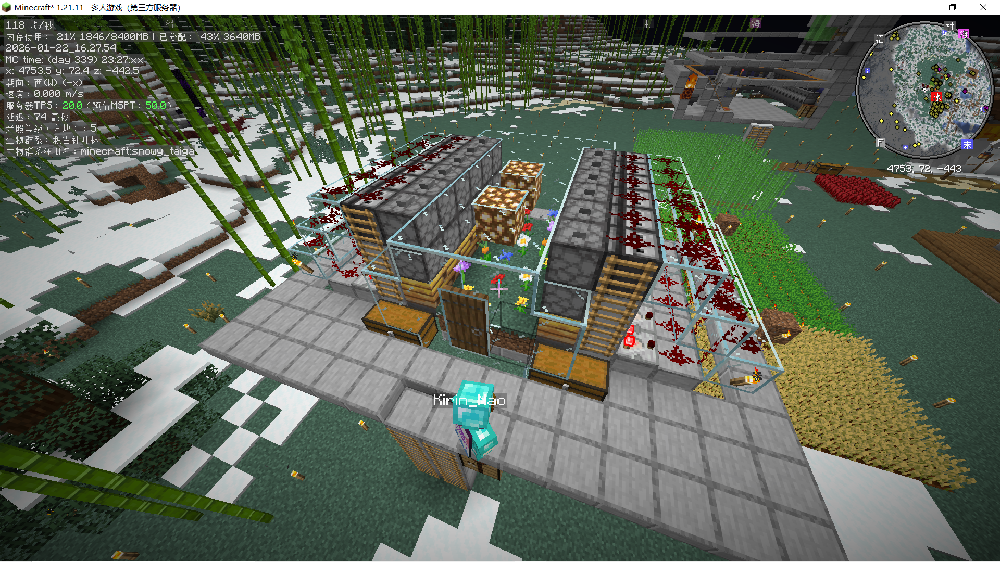

# Minecraft 服务器


///caption
由 Kirin_Nao 学长造的蜂蜜机
///

目前有一个由学生自建的 Minecraft 1.21.11 原版生存服务器，目前活跃人员有 5 人左右。

## 整合包常用键位

M 投影，N 大地图，Y 路径点，J 周期性攻击，K 周期性使用，Z 开关光影，V 开麦，U 灵魂出窍，R 整理背包/箱子，H 开关 minihud，X+C Tweakeroo，H+C MiniHUD，按住shift全丢，按住 alt 左键放同类物品。shift 背包内预览潜影盒，alt 预览被放下的箱子/潜影盒。

[批量合成/交易（ItemScroller）](https://www.bilibili.com/opus/950691633772363800)

[假人使用（Carpet）](https://www.bilibili.com/video/BV1zt4y1T7Co)

## 镜像服跨服

服务器配置了 velocity，可以在生电服和镜像服之间切换。`/server survial` 来切换到生电服；`/server creative` 来切换到镜像服。

其中镜像服玩家是拥有所有命令权限的（例如 `/fill` `/gamemode`），可以进行红石机器的测试。镜像服没有在线 3D 地图。

⚠️ 生电服的地图会定期同步到镜像服，也就是说镜像服里面的东西会被重置掉，建议镜像服只用来测试红石机器或特性。

## 基岩版互通

需要基岩版正版帐号。

| Server Address | Port  |
|----------------|-------|
| play.leak.moe  | 19132 |

### 基岩版、Java 版本绑定

两个版本同时进入服务器，在基岩版或 Java 版中输入 `/linkaccount`。然后你会看到一串随机的数字，在另一端中输入 `/linkaccount <random_number>` 即可。
随后两端都会被踢出服务器，并收到帐号已经完成绑定的提示消息。

## 在线 3D 地图

<iframe src="https://maps.leak.moe" width="100%" height="500px" title="在线 3D 地图"></iframe>

## 资源下载

<iframe src="https://download.leak.moe/share/69723aec208fb/" width="100%" height="500px" title="资源下载"></iframe>

## 加入方式

服务器目前是白名单制+正版验证。你可以发送邮箱至 i@leak.moe 来提交申请。

格式为：
```
Title: Invivation Request
Context:
Nickname: 
Minecraft ID: 
Contact: 
```
