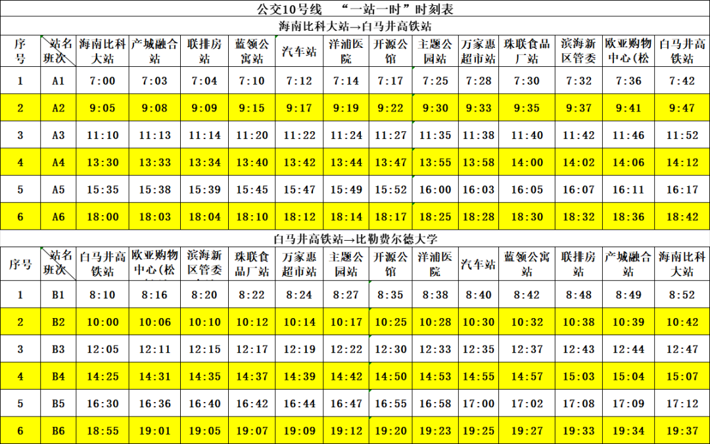
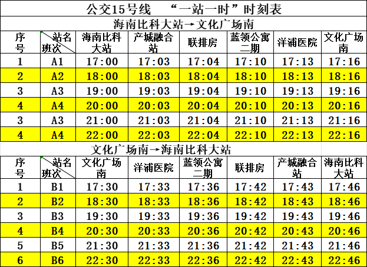
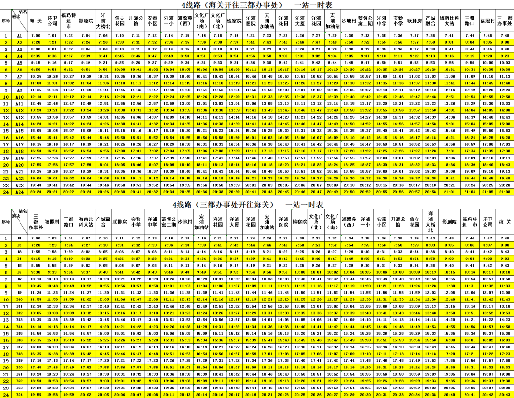

# 校园出行

## 前往白马井高铁站

目前前往白马井的方式主要是两种：

- 在拼车群中找人拼车
- 坐公交车

在海南比科大站坐洋浦10路公交车至白马井高铁站即可到达。但发车并不多，
发车时间为定点发车，具体发车表见下文。

## 前往文化广场

开电动车前往或乘坐15路公交，约 20 分钟。

文化广场内有电影院、KFC、必胜客和霸王茶姬等餐饮娱乐场所。还有一个超市可以购买生活用品。

## 前往幸福城夜市

可通过校内的可租借小电驴前往，也可以步行前往。小电驴大概 10 分钟到达，步行大概 40 分钟。

## 时刻表

### 10号线时刻表

### 15号线时刻表

### 4号线时刻表

